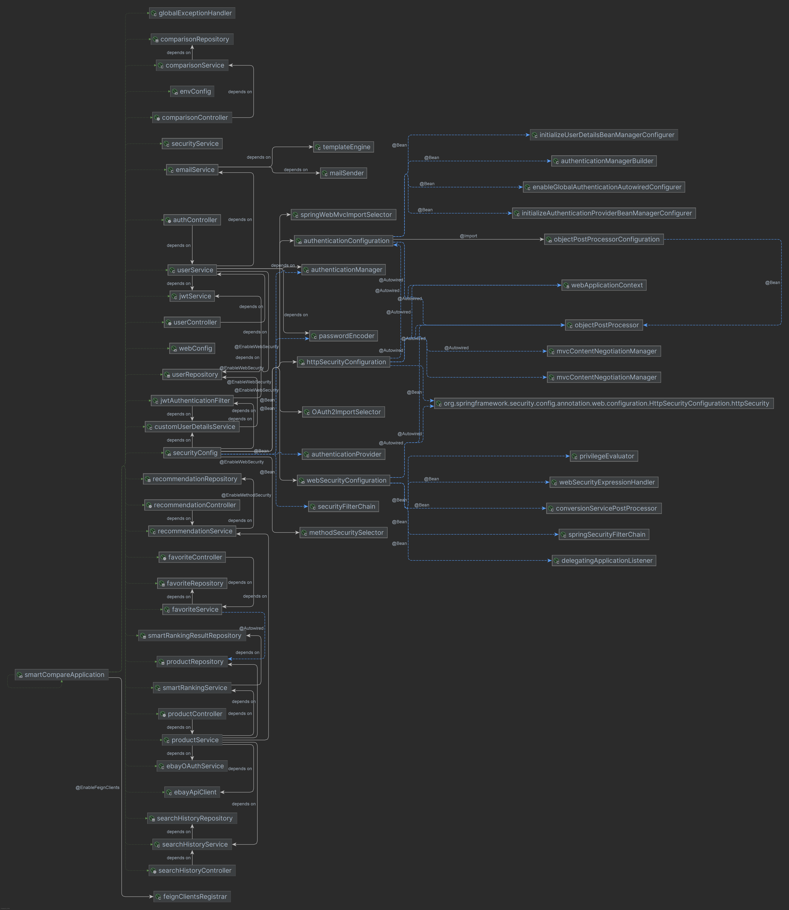

# SmartCompare - Análisis Inteligente de Ofertas en eBay

## CS 2031 Desarrollo Basado en Plataforma

**Integrantes del equipo:**
- Nicolás Vasquez de Velasco
- José Álvaro Rojas Cruz
- Alfonso Wan Tapia
- Bruno William García López
- Fernando Espinoza Torres

---

## Índice

1. [Introducción](#introducción)
2. [Identificación del Problema o Necesidad](#identificación-del-problema-o-necesidad)
3. [Descripción de la Solución](#descripción-de-la-solución)
4. [Modelo de Entidades](#modelo-de-entidades)
5. [Testing y Manejo de Errores](#testing-y-manejo-de-errores)
6. [Medidas de Seguridad Implementadas](#medidas-de-seguridad-implementadas)
7. [Eventos y Asincronía](#eventos-y-asincronía)
8. [GitHub](#github)
9. [Conclusión](#conclusión)
10. [Apéndices](#apéndices)

---

## Introducción

### Contexto

En el mercado de productos electrónicos usados, los usuarios enfrentan el reto de comparar múltiples ofertas en plataformas como eBay, donde la información disponible es limitada y la toma de decisiones puede ser compleja. La necesidad de una herramienta que agilice la comparación y destaque las mejores opciones es cada vez más relevante.

### Objetivos del Proyecto

- Facilitar la búsqueda y comparación de productos usados en eBay.
- Proveer un análisis inteligente basado en los datos de resumen de la API de eBay.
- Permitir a los usuarios guardar favoritos, consultar su historial de búsquedas y recibir recomendaciones personalizadas.

---

## Identificación del Problema o Necesidad

### Descripción del Problema

Los usuarios de eBay deben filtrar manualmente cientos de listados para encontrar productos que ofrezcan el mejor balance entre precio y condición. La falta de herramientas que automaticen este análisis, considerando solo los datos disponibles públicamente, dificulta la toma de decisiones informadas y rápidas.

### Justificación

Resolver este problema permite a los usuarios ahorrar tiempo, tomar mejores decisiones de compra y evitar ofertas poco atractivas, mejorando así su experiencia en el mercado de productos usados.

---

## Descripción de la Solución

### Funcionalidades Implementadas

- **Búsqueda de productos en eBay:** Consulta la API de eBay y muestra los resultados relevantes.
- **Ranking inteligente:** Algoritmo propio que destaca las mejores opciones según precio, condición y relevancia del título.
- **Sistema de favoritos:** Permite guardar productos destacados para referencia futura.
- **Historial de búsquedas:** Guarda automáticamente las búsquedas realizadas por el usuario.
- **Recomendaciones automáticas:** Sugiere productos destacados basados en el análisis inteligente.
- **Autenticación y autorización:** Registro, login y gestión de roles con JWT.
- **Envío de correo de confirmación:** Al registrar un usuario, se envía automáticamente un correo de bienvenida y/o confirmación usando `EmailService` y plantillas Thymeleaf.

### Tecnologías Utilizadas

- **Backend:** Java 17, Spring Boot, Spring Security, Spring Data JPA
- **Base de datos:** PostgreSQL/MySQL (según despliegue)
- **API externa:** eBay Browse API
- **Correo electrónico:** Spring Mail, Thymeleaf para plantillas de email.
- **Testing:** JUnit, Mockito
- **Gestión de dependencias:** Maven
- **Herramientas adicionales:** GitHub Actions, Docker (opcional)

---

## Modelo de Entidades

### Diagrama de Entidades

### Descripción de Entidades

- **Usuario:** id, nombre, email, password, rol, tipo de autenticación.
- **Producto:** id, ebayItemId, título, condición, precio, moneda, imagen, url, ubicación.
- **Favorito:** id, usuarioId, productoId, fecha de guardado.
- **Historial de Búsqueda:** id, usuarioId, términos, fecha.
- **Análisis de Búsqueda:** id, términos, fecha, usuarioId, topProductItemIds, justificación.
- **Recomendación:** id, usuarioId, productoId sugerido, razón.

Las relaciones principales son:
- Un usuario puede tener muchos favoritos, búsquedas y recomendaciones.
- Un favorito referencia a un producto.
- Un análisis de búsqueda referencia a los productos destacados.

---

## Testing y Manejo de Errores

### Niveles de Testing Realizados

- **Pruebas unitarias:** Servicios, lógica de ranking, controladores.
- **Pruebas de integración:** Interacción con la base de datos y API de eBay.
- **Pruebas de sistema:** Flujo completo de usuario (autenticación, búsqueda, favoritos).
- **Pruebas de aceptación:** Validación de requisitos funcionales.

### Resultados

Las pruebas unitarias y de integración cubren los casos principales, incluyendo búsquedas, ranking y manejo de favoritos. Se detectaron y corrigieron errores en la lógica de ranking y validación de datos de entrada.

### Manejo de Errores

Se implementó un manejador global de excepciones (`GlobalExceptionHandler`) que captura errores comunes (entidad no encontrada, validaciones, errores de autenticación) y retorna respuestas claras al cliente. Esto previene fugas de información sensible y mejora la experiencia de usuario.

---

## Medidas de Seguridad Implementadas

### Seguridad de Datos

- **Autenticación JWT:** Todas las rutas protegidas requieren un token válido.
- **Cifrado de contraseñas:** Uso de BCrypt para almacenar contraseñas.
- **Gestión de roles:** Control de acceso basado en roles (usuario, admin).

### Prevención de Vulnerabilidades

- **Validación de entradas:** Uso de anotaciones de validación y DTOs.
- **Protección contra inyección SQL:** Uso de JPA/Hibernate.
- **Protección CSRF/XSS:** Endpoints REST sin sesiones, sanitización de datos.

---

### Eventos y Asincronía

- **Envío de correos de confirmación:** Al registrar un usuario, se envía un correo de bienvenida/confirmación de manera asíncrona utilizando `EmailService` y plantillas HTML.
- **Consultas a la API de eBay:** Realizadas de forma asíncrona para no bloquear el hilo principal.

La asincronía es clave para mejorar la experiencia de usuario y la escalabilidad del sistema, evitando bloqueos y permitiendo la gestión eficiente de tareas de larga duración.

---

## GitHub

- **GitHub Projects:** Se utilizó para organizar tareas.
- **GitHub Actions:** No se uso GitHub Actions.

---

## Conclusión

### Logros del Proyecto

- Se logró automatizar el análisis de ofertas en eBay, facilitando la toma de decisiones para los usuarios.
- El sistema es seguro, escalable y fácil de mantener.

### Aprendizajes Clave

- Profundización en Spring Boot, seguridad con JWT y consumo de APIs externas.
- Importancia de la validación y el testing en proyectos reales.

### Trabajo Futuro

- Implementar la interfaz de usuario.
- Integrar más fuentes de datos (otras plataformas).
- Implementar notificaciones en tiempo real y recomendaciones avanzadas.

---

## Apéndices

### Licencia

Este proyecto se distribuye bajo la licencia MIT. Ver el archivo LICENSE para más detalles.

### Referencias

- [Documentación oficial de Spring Boot](https://spring.io/projects/spring-boot)
- [eBay API](https://developer.ebay.com/api-docs/static/ebay-rest-landing.html)
- [Guía de seguridad Spring](https://spring.io/guides/gs/securing-web/)